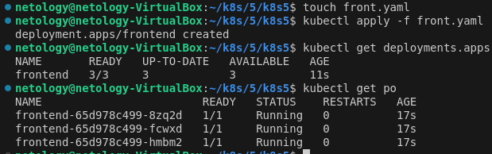
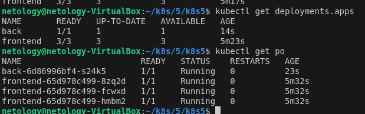
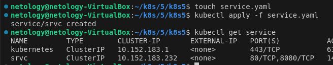

### 1







```
netology@netology-VirtualBox:~/k8s/5/k8s5$ kubectl get svc
NAME         TYPE        CLUSTER-IP       EXTERNAL-IP   PORT(S)    AGE
kubernetes   ClusterIP   10.152.183.1     <none>        443/TCP    93m
srvc         ClusterIP   10.152.183.232   <none>        80/TCP     30m
srvcback     ClusterIP   10.152.183.207   <none>        8080/TCP   5m8s
netology@netology-VirtualBox:~/k8s/5/k8s5$ kubectl exec back-6d86996bf4-s24k5 -- curl srvc:80
  % Total    % Received % Xferd  Average Speed   Time    Time     Time  Current
                                 Dload  Upload   Total   Spent    Left  Speed
100   615  100   615    0     0   600k      0 --:--:-- --:--:-- --:--:--  600k
<!DOCTYPE html>
<html>
<head>
<title>Welcome to nginx!</title>
<style>
html { color-scheme: light dark; }
body { width: 35em; margin: 0 auto;
font-family: Tahoma, Verdana, Arial, sans-serif; }
</style>
</head>
<body>
<h1>Welcome to nginx!</h1>
<p>If you see this page, the nginx web server is successfully installed and
working. Further configuration is required.</p>

<p>For online documentation and support please refer to
<a href="http://nginx.org/">nginx.org</a>.<br/>
Commercial support is available at
<a href="http://nginx.com/">nginx.com</a>.</p>

<p><em>Thank you for using nginx.</em></p>
</body>
</html>
netology@netology-VirtualBox:~/k8s/5/k8s5$ kubectl exec back-6d86996bf4-s24k5 -- curl srvcback:8080
  % Total    % Received % Xferd  Average Speed   Time    Time     Time  Current
                                 Dload  Upload   Total   Spent    Left  Speed
100   137  100   137    0     0   122k      0 --:--:-- --:--:-- --:--:--  133k
WBITT Network MultiTool (with NGINX) - back-6d86996bf4-s24k5 - 10.1.9.72 - HTTP: 1180 , HTTPS: 443 . (Formerly praqma/network-multitool)
netology@netology-VirtualBox:~/k8s/5/k8s5$ kubectl exec frontend-65d978c499-8zq2d -- curl srvcback:8080
  % Total    % Received % Xferd  Average Speed   Time    Time     Time  Current
                                 Dload  Upload   Total   Spent    Left  Speed
  0     0    0     0    0     0      0      0 --:--:-- --:--:-- --:--:--     0WBITT Network MultiTool (with NGINX) - back-6d86996bf4-s24k5 - 10.1.9.72 - HTTP: 1180 , HTTPS: 443 . (Formerly praqma/network-multitool)
100   137  100   137    0     0  96343      0 --:--:-- --:--:-- --:--:--  133k
netology@netology-VirtualBox:~/k8s/5/k8s5$ kubectl exec frontend-65d978c499-8zq2d -- curl srvc:80
  % Total    % Received % Xferd  Average Speed   Time    Time     Time  Current
                                 Dload  Upload   Total   Spent    Left  Speed
  0     0    0     0    0     0      0      0 --:--:-- --:--:-- --:--:--     0<!DOCTYPE html>
<html>
<head>
<title>Welcome to nginx!</title>
<style>
html { color-scheme: light dark; }
body { width: 35em; margin: 0 auto;
font-family: Tahoma, Verdana, Arial, sans-serif; }
</style>
</head>
<body>
<h1>Welcome to nginx!</h1>
<p>If you see this page, the nginx web server is successfully installed and
working. Further configuration is required.</p>

<p>For online documentation and support please refer to
<a href="http://nginx.org/">nginx.org</a>.<br/>
Commercial support is available at
<a href="http://nginx.com/">nginx.com</a>.</p>

<p><em>Thank you for using nginx.</em></p>
</body>
</html>
100   615  100   615    0     0   539k      0 --:--:-- --:--:-- --:--:--  600k
```